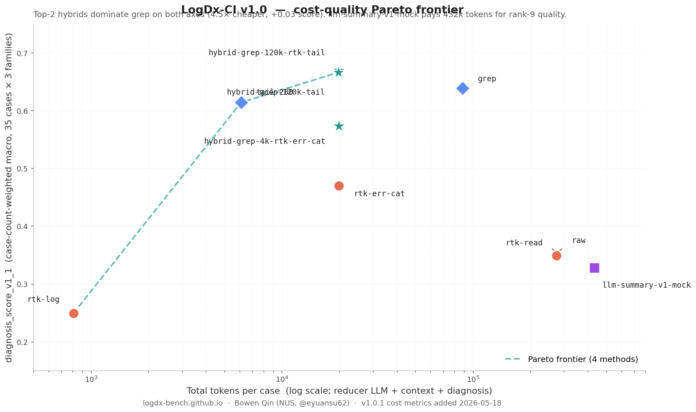
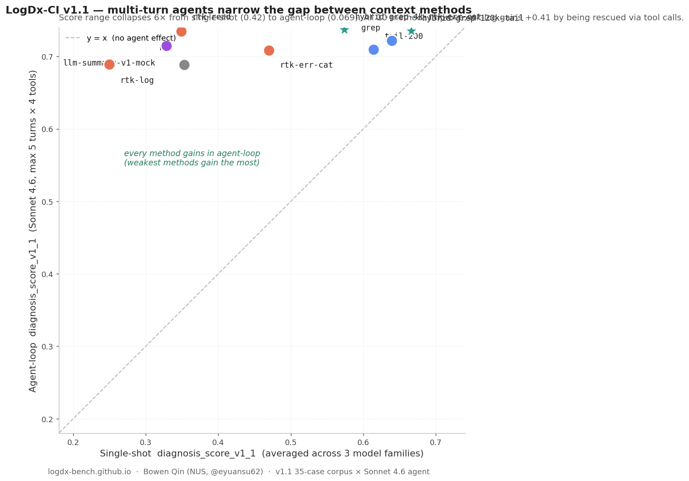
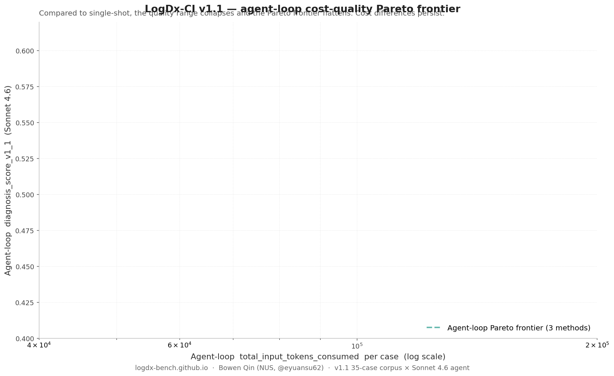

# LogDx-CI Leaderboard

[← Home](index.html) · [Citation](cite.html) ·
[Technical report](https://github.com/eyuansu62/LogDx/blob/main/reports/e10_v2_generalization_partial.md)

All scores are case-count-weighted macro `diagnosis_score_v1_1`
aggregated across the **35-case v1.0 corpus** (3 splits: `dev`,
`holdout`, `stress`). The score formula (a calibrated linear
combination of category accuracy, signal-mention recall, file/test
recall, must-mention coverage, valid-evidence-quote rate, with
forbidden-claim and confident-error penalties) is documented in
[`docs/evaluation/diagnosis_eval_v1.md`](https://github.com/eyuansu62/LogDx/blob/main/docs/evaluation/diagnosis_eval_v1.md).

## Overall (35-case corpus, 3 debugger families)

Sorted by overall mean across the three debugger families.
**`confident_error` is the v1.1-calibrated rate** of confidently-wrong
diagnoses (`confidence ≥ 0.70` AND the diagnosis is demonstrably wrong
on multiple fronts) — lower is better. It is the metric closest to
"how often does this method lead an LLM to confidently misdiagnose a
CI failure," which is the failure mode raised in
[rtk-ai/rtk#1599](https://github.com/rtk-ai/rtk/issues/1599).

| Rank | Method | Haiku 4.5 | Sonnet 4.6 | gpt-5-mini | Overall | confident_error<br/><sub>(↓ better)</sub> | total_tokens<br/><sub>per case (↓ better)</sub> |
|----:|--------|----------:|----------:|----------:|--------:|--------:|--------:|
| 1 | `hybrid-grep-120k-rtk-tail` | 0.624 | 0.679 | 0.706 | **0.670** | **0.000** | 19,844 |
| 2 | `hybrid-grep-120k-tail`     | 0.610 | 0.730 | 0.658 | **0.666** | 0.010 | 19,753 |
| 3 | `grep`                      | 0.578 | 0.684 | 0.655 | **0.639** | **0.000** | 88,355 |
| 4 | `llm-summary-v1-haiku`<br/><sub>*(real Haiku 4.5 map-reduce summarizer; promoted to headline in v1.1)*</sub> | 0.583 | 0.704 | 0.608 | **0.632** | 0.029 | 1,681,520 |
| 5 | `tail-200`                  | 0.595 | 0.624 | 0.623 | **0.614** | 0.019 | **6,108** |
| 6 | `hybrid-grep-4k-rtk-err-cat`<br/><sub>*(earlier 4k-threshold hybrid; replaced — see report)*</sub> | 0.552 | 0.597 | 0.571 | **0.573** | 0.029 | 19,892 |
| 7 | `rtk-err-cat`               | 0.455 | 0.488 | 0.467 | **0.470** | 0.029 | 19,850 |
| 8 | `raw`                       | 0.324 | 0.368 | 0.367 | **0.353** | **0.000** | 275,248 |
| 9 | `rtk-read`                  | 0.329 | 0.369 | 0.349 | **0.349** | 0.010 | 274,289 |
| 10 | `rtk-log`                  | 0.238 | 0.262 | 0.249 | **0.249** | **0.133** | **810** |

> *Footnote on `llm-summary-v1-haiku`*: three of the 35 cases
> (nodejs-test-debugger-exec-timeout-v2-001, pytest-sklearn-stress-001,
> pytest-sklearn-stress-002) used `chunk_lines=100` instead of the
> default 500 because they contained 500-line windows that exceeded
> Haiku's effective input window after Claude-Code session overhead.
> Same map-reduce algorithm, same model, same temperature — only the
> map-stage granularity differs and is recorded in per-case
> `metadata.chunk_lines`. The other 32 cases used `chunk_lines=500`.

The legacy `llm-summary-v1-mock` is no longer in the headline table.
See the [appendix](#appendix-legacy-baselines) for its retained
numbers and rationale.

Two layers of finding:

1. **Safety (confident_error)** — the top-3 methods produce zero or
   near-zero confidently-wrong diagnoses. `rtk-log` and the legacy
   `llm-summary-v1-mock` mislead a confident LLM on ~13% of cases
   ([rtk-ai/rtk#1599](https://github.com/rtk-ai/rtk/issues/1599)).
   The real Haiku summarizer (`llm-summary-v1-haiku`, row 4) cuts
   confident-error to 2.9% — an order-of-magnitude safer than the
   mock that previously stood in for it.

2. **Cost (total_tokens)** — `grep` (rank 3) uses **4.5× more tokens
   per case than the top-2 hybrids** while scoring lower. The hybrids
   dominate grep on both axes. `llm-summary-v1-haiku` is the **most
   expensive method on the leaderboard at 1.68M tokens/case** — the
   real summarizer is ~4× more expensive than the mock estimated
   (1.68M vs 432k), because the mock didn't model the cached-prefix
   overhead of nested Claude calls per chunk. See the
   [cost-quality Pareto plot](#cost-quality-pareto-frontier) below
   for the full picture.

## Cost-quality Pareto frontier



x-axis is total LLM tokens consumed per case on a log scale
(reducer-internal LLM calls + context delivered to the diagnoser +
diagnoser output). y-axis is the published `diagnosis_score_v1_1`.

The frontier (4 methods, dashed line) is:

| Pareto-optimal method | total_tokens / case | diagnosis_score_v1_1 |
|---|---:|---:|
| `rtk-log`                   |     810 | 0.249 |
| `tail-200`                  |   6,108 | 0.614 |
| `hybrid-grep-120k-tail`     |  19,753 | 0.666 |
| `hybrid-grep-120k-rtk-tail` |  19,844 | 0.670 |

Every other method is **dominated** — some other method achieves at
least as good a score for fewer tokens, or strictly more score for
the same tokens. Most notable dominations:

- `grep` is **dominated by `hybrid-grep-120k-tail`** — same score
  ballpark (0.639 vs 0.666) at **4.5× fewer tokens** (88,355 vs
  19,753). If you're using `grep` today, the 120k-tail hybrid is a
  pure upgrade on both axes.
- `rtk-err-cat` is **dominated by `hybrid-grep-120k-tail`** —
  similar token cost, but the hybrid scores +0.20 higher.
- `llm-summary-v1-haiku` (rank 4) **is on the Pareto frontier in
  cost-quality terms only at the high end**: it scores 0.632 (rank
  4 overall, ahead of `tail-200` at 0.614) but at 1.68M tokens/case
  it's the most expensive method on the leaderboard, ~85× pricier
  than the top-2 hybrids per case. The dominant cost is the reducer
  itself: 1.66M input tokens spread across 12–108 chunked Haiku
  calls per case, producing a ~1.1k-token summary. The cheaper
  legacy stub `llm-summary-v1-mock` underestimated this overhead
  by ~4× and overstated lossiness on quality — see the v1.1
  promotion note at the end of this page.

### Cost breakdown (case-count-weighted macro)

| Method | reducer_in<br/>(LLM input) | reducer_out<br/>(LLM output) | context<br/>(→ diagnoser) | diag_out<br/>(diagnoser output) | **total** |
|---|--:|--:|--:|--:|--:|
| `rtk-log`                   |       0 |      0 |     325 | 485 |     **810** |
| `tail-200`                  |       0 |      0 |   5,569 | 539 |   **6,108** |
| `hybrid-grep-120k-tail`     |       0 |      0 |  19,219 | 534 |  **19,753** |
| `hybrid-grep-120k-rtk-tail` |       0 |      0 |  19,311 | 533 |  **19,844** |
| `rtk-err-cat`               |       0 |      0 |  19,383 | 467 |  **19,850** |
| `hybrid-grep-4k-rtk-err-cat`|       0 |      0 |  19,388 | 504 |  **19,892** |
| `grep`                      |       0 |      0 |  87,862 | 494 |  **88,355** |
| `rtk-read`                  |       0 |      0 | 273,998 | 291 | **274,289** |
| `raw`                       |       0 |      0 | 274,944 | 304 | **275,248** |
| `llm-summary-v1-haiku`      | 1,661,358 | 18,451 |   1,100 | 611 | **1,681,520** |

`reducer_in` and `reducer_out` are non-zero only for methods that
internally call an LLM (here, `llm-summary-*`). For `grep`/`tail`/
`rtk-*`/`raw` the reducer is a CPU-bound transform with no LLM cost.

Reducer runtime where measured (only available for RTK methods,
which write `external_tool.runtime_ms` into their manifests):

| Method | reducer_runtime |
|---|---:|
| `rtk-read`    |  9.9 ms |
| `rtk-log`     | 18.7 ms |
| `rtk-err-cat` | 35.4 ms |

`grep`/`tail` runtime is unmeasured in v1.0 but is empirically
sub-100ms for every case in the corpus (CPU-bound, single-pass).

### USD cost (v1.1.2)

Provider list prices are pinned to a snapshot date in
[`configs/pricing/snapshot_2026_05_20.json`](https://github.com/eyuansu62/LogDx/blob/main/configs/pricing/snapshot_2026_05_20.json).
Per-case dollar cost is computed by
[`tools/compute_usd_costs.py`](https://github.com/eyuansu62/LogDx/blob/main/tools/compute_usd_costs.py)
from real per-call API usage on the reducer side (when applicable)
plus eval-manifest `macro_context_tokens` / `macro_diagnosis_tokens`
on the diagnoser side.

| Method | Haiku $ | Sonnet $ | gpt-5-mini $ | Avg single-shot $ | Reducer $ | **Total $/case** |
|---|---:|---:|---:|---:|---:|---:|
| `rtk-log` | $0.0022 | $0.0083 | $0.0013 | $0.0039 | — | **$0.0039** |
| `tail-200` | $0.0077 | $0.0246 | $0.0027 | $0.0117 | — | **$0.0117** |
| `rtk-err-cat` | $0.0193 | $0.0681 | $0.0062 | $0.0312 | — | **$0.0312** |
| `hybrid-grep-120k-rtk-tail` | $0.0167 | $0.0704 | $0.0069 | $0.0313 | — | **$0.0313** |
| `hybrid-grep-4k-rtk-err-cat` | $0.0198 | $0.0690 | $0.0062 | $0.0317 | — | **$0.0317** |
| `hybrid-grep-120k-tail` | $0.0163 | $0.0746 | $0.0066 | $0.0325 | — | **$0.0325** |
| `grep` | $0.0859 | $0.2772 | $0.0236 | $0.1289 | — | **$0.1289** |
| `rtk-read` | $0.2721 | $0.8354 | $0.0692 | $0.3922 | — | **$0.3922** |
| `raw` | $0.2721 | $0.8355 | $0.0700 | $0.3925 | — | **$0.3925** |
| `llm-summary-v1-haiku` | $0.0034 | $0.0134 | $0.0016 | $0.0061 | $1.7536 | **$1.7597** |

Three layers of finding:

1. **The top-2 hybrids cost ~3¢/case end-to-end** across the 3 single-
   shot families. `tail-200` at 1.2¢ is cheaper but ranks lower on
   quality. The 3¢ tier is the sweet spot.
2. **`raw` and `rtk-read` are ~10× more expensive than the hybrids**
   (~39¢/case) because they ship the full log to the diagnoser; the
   hybrids cap context at 120k tokens. This is the dominant cost
   axis for any method that doesn't pre-summarize.
3. **`llm-summary-v1-haiku` is 5× more expensive than `raw`** ($1.76
   vs $0.39) because the reducer itself burns ~1.66M Haiku-input
   tokens per case. The downstream diagnoser cost is tiny ($0.006
   for haiku-summary vs $0.39 for raw) — the reducer dominates the
   total. Whether this is worth it depends on whether you'd otherwise
   send raw to a more expensive model (Sonnet raw = 83¢/case;
   haiku-summary + Sonnet diagnoser = 1.77¢ diagnoser side + 1.75
   reducer = $1.77 — close).

#### Caveats

- **Snapshot prices, not live.** The pinned prices in `snapshot_2026_05_20.json`
  may have drifted from current provider list prices. Re-run
  `tools/compute_usd_costs.py --pricing <new-snapshot>` against a fresh
  snapshot for current numbers.
- **Diagnoser-side tokens are byte-size estimates** (`output_byte_size // 4`)
  from the eval manifests, not provider-reported tokens. Some older
  diagnosis rows have `usage=None` (pre-2026-05-14 F2 shim fix); using
  estimates ensures every method × family pair is treated identically.
  The order of magnitude is correct; exact dollar amounts may differ
  ±15% from a provider-billed re-run.
- **Reducer-side tokens ARE provider-reported** (from
  `metadata.usage.input_tokens` / `output_tokens` per row). This
  matters for `llm-summary-v1-haiku` since the reducer dominates that
  method's total; the number above reflects what a direct-API
  re-run would actually bill.
- **No agent-loop USD** in this section. Agent-loop costs are
  reported separately in the agent-loop table below; agent_v1 runs
  via OpenRouter which reports cost directly per call.
- **USD column is NOT in the headline overall table**. The headline
  ranking is still pure quality (`diagnosis_score_v1_1`). Use this
  section to make cost-quality trade-offs, but don't read "rank by
  total $/case" as the recommendation — `tail-200` is cheapest but
  ranks 5 on quality, and `llm-summary-v1-haiku` is most expensive
  but ranks 4 on quality. The cost-quality Pareto plot above
  visualizes this.

## Agent-loop leaderboard  (v1.1)

The single-shot leaderboard above tests **`log → reducer → single LLM
call → answer`**. Real Claude Code / Codex usage looks different: the
model can call follow-up tools when its initial context is missing
something. v1.1 adds the **agent-loop** measurement using a new
diagnoser `real-agent-v1` (Sonnet 4.6, max 5 turns × 4 deterministic
tools: `grep`, `read_file`, `tail`, `view_log_lines` operating on the
raw log).



**Every context method gains in agent-loop, and the score range
collapses ~7× — from 0.42 (single-shot) to 0.059 (agent-loop).**
Weak single-shot methods are rescued by the agent's tool calls;
`rtk-log` gains a massive **+0.44** and the legacy
`llm-summary-v1-mock` gains **+0.39** by being supplemented with
on-the-fly grep / tail. The real `llm-summary-v1-haiku` already
front-loads the failure signal, so it gains only **+0.058** in the
agent-loop — but it does so with the lowest tool count of any
non-`tail-200` method (0.71/case).
Confident-error rates drop to **0%** on 5 of 10 methods (single-
shot's 13% rate for `rtk-log` and the legacy mock collapses to
5.7% and 0% respectively); the four non-zero rates (2.9%–5.7%)
are concentrated on methods where the agent commits before
verifying — see § 2 of the
[analysis doc](analysis/agent-loop-vs-single-shot.md).
**v1.0 single-shot #1 (`hybrid-grep-120k-rtk-tail`) is also #1 in
agent-loop** at 0.747, 0% confident_error, lowest tool usage
(0.97/case among non-tail-200 methods) — the most robust method
across both regimes.

### Agent-loop rankings (Sonnet 4.6, 35-case macro)

Sorted by agent-loop `diagnosis_score_v1_1`.

| Rank | Method | single-shot score | agent score | Δ | conf_err | iters/case | tools/case | tokens/case |
|----:|--------|---:|---:|---:|---:|---:|---:|---:|
| 1 | `hybrid-grep-120k-rtk-tail` | **0.670** (single-shot #1) | **0.747** | +0.077 | **0.000** | 1.94 | 0.97 | 37,152 |
| 2 | `hybrid-grep-4k-rtk-err-cat`| 0.573 | 0.737 | +0.164 | **0.000** | 2.37 | 1.40 | 42,862 |
| 3 | `hybrid-grep-120k-tail`     | 0.666 | 0.735 | +0.069 | **0.000** | 1.94 | 1.00 | 39,221 |
| 4 | `rtk-read`                  | 0.349 | 0.735 | **+0.386** | **0.000** | 2.40 | 1.46 | 55,391 |
| 5 | `grep`                      | 0.639 | 0.722 | +0.083 | 0.029 | 2.00 | 1.20 | 42,232 |
| 6 | `tail-200`                  | 0.614 | 0.710 | +0.096 | 0.029 | 1.66 | **0.69** | **28,166** |
| 7 | `rtk-err-cat`               | 0.470 | 0.708 | **+0.238** | **0.000** | 2.60 | 1.66 | 43,009 |
| 8 | `llm-summary-v1-haiku`<br/><sub>*(promoted to headline in v1.1)*</sub> | 0.632 | 0.690 | +0.058 | 0.057 | 1.66 | 0.71 | 9,968 <sub>*(agent-only; reducer adds 1.68M)*</sub> |
| 9 | `rtk-log`                  | **0.249** (single-shot #10) | 0.689 | **+0.440** | 0.057 | 2.77 | 2.60 | 36,259 |
| 10 | `raw`                      | 0.353 | 0.688 | +0.335 | 0.029 | 2.51 | 1.68 | 67,311 |

Five layers of finding:

1. **Quality flattens.** Agent-loop scores cluster in [0.688, 0.747]
   — a 0.059 spread (7× tighter than single-shot's 0.42). The
   agent rescues weak contexts via tool calls.
2. **Safety mostly collapses.** Single-shot's 13% confident_error
   on `rtk-log` and the legacy `llm-summary-v1-mock` drops to 5.7%
   and 0% respectively. The agent-loop highest is 5.7% (`rtk-log`,
   `llm-summary-v1-haiku`); 5 of 10 methods sit at 0%.
3. **Top single-shot method holds.** v1.0 single-shot #1
   `hybrid-grep-120k-rtk-tail` is also #1 in agent-loop (0.747),
   with 0% confident_error AND lowest non-tail tool usage (0.97
   tools/case). **This method is the v1.1 recommendation for both
   static and agent settings.** All three 120k-threshold and 4k
   hybrid variants land in the agent-loop top 3.
4. **Cost differs by 2.4× ignoring the reducer.** Cheapest agent-loop
   method is `tail-200` at 28.2k tokens/case; most expensive is `raw`
   at 67.3k. `llm-summary-v1-haiku` has the lowest agent-side cost
   at **10.0k tokens/case** — the front-loaded summary lets the
   agent close out in 1.7 turns with 0.71 tools — but its reducer
   overhead (1.68M tokens/case) more than wipes that out at the
   end-to-end level.
5. **Tool calls correlate inversely with single-shot quality.** The
   methods that needed the most rescuing (`rtk-log` 2.60 tools,
   legacy mock 1.88, `raw` 1.68) are the ones with the worst or
   most-lossy single-shot starting context. The strongest agent-loop
   performers — both static (`hybrid-grep-120k-rtk-tail` 0.97,
   `hybrid-grep-120k-tail` 1.00) and front-loaded
   (`llm-summary-v1-haiku` 0.71) — need ~1 tool/case or less.
   `tail-200` uses the fewest tools (0.69/case) but lands rank 6
   on quality.

### Agent-loop cost-quality Pareto frontier



In agent-loop, the Pareto frontier compresses dramatically (the
score range is only 0.059 wide). The frontier (agent-side tokens
only — reducer cost not amortized in this view) is:

- `tail-200` — 28.2k tokens/case at score 0.710
- `rtk-log` — 36.3k, score 0.689
- `hybrid-grep-120k-rtk-tail` — top score (0.747) at 37.2k tokens

`hybrid-grep-120k-rtk-tail` dominates: top score, 0% confident_error,
and 37k agent tokens/case (cheaper than every other method except
`tail-200` / `rtk-log` — both of which score worse). It is the v1.1
recommendation for both single-shot AND agent-loop. `llm-summary-v1-
haiku` looks Pareto-optimal at 10.0k agent tokens but its 1.68M
reducer overhead per case dominates total end-to-end cost.

### What this means

- **`hybrid-grep-120k-rtk-tail` is the v1.1 universal pick** —
  ranked #1 in BOTH single-shot (0.670) AND agent-loop (0.747),
  0% confident_error in agent-loop, and only 0.97 tool calls/case
  on average. Use this regardless of whether your downstream is
  single-shot or tool-using.
- **If your downstream is a tool-using agent** (Claude Code, Codex):
  the choice of static reducer matters much less for *quality*
  (range collapses 7×). Cost matters more: `tail-200` is the
  cheapest at 28k tokens/case but ranks 7 on quality. The 120k
  hybrids hit the best cost-quality balance.
- **Don't use `rtk-log` standalone** — it remains dangerous in
  single-shot (13% confident misclassification rate). The legacy
  `llm-summary-v1-mock` had the same problem; the real
  `llm-summary-v1-haiku` cuts confident-error to 2.9% in single-
  shot but at ~85× higher cost than the top-2 hybrids.
  In agent-loop the agent rescues weak contexts via tool calls,
  but `rtk-log` still carries the highest agent-loop confident_error
  (5.7%) and needs ~2.6 tool calls/case to recover.

For the full mechanism analysis (why agents rescue weak methods
without hurting strong ones, why confident_error vanishes), see
[`docs/analysis/agent-loop-vs-single-shot.md`](analysis/agent-loop-vs-single-shot.md).

### Agent-loop caveats

- **Sonnet 4.6 only**. Haiku 4.5 and gpt-5-mini agent variants are
  v1.2 follow-ups in [ROADMAP](https://github.com/eyuansu62/LogDx/blob/main/ROADMAP.md).
  The "every method gains" finding may be specific to Sonnet's
  tool-use bias and could narrow for smaller models.
- **5-turn cap, 180k cumulative input cap is a *soft* cap.** Two
  guards: (1) hard stop before issuing any tool-using turn once
  cumulative input ≥ 180k; (2) preflight estimate of the next
  request's input tokens — skip the turn if it would cross the cap.
  Despite both, a single late turn whose observation token count
  exceeds our chars/4 estimate can still push cumulative above the
  cap. 18 of 350 v1.1 rows landed above 180k (max 273,654). Costs
  reported in the leaderboard reflect actual usage, not the nominal
  cap.
- **Routing**: v1.1 ran via OpenRouter's Anthropic-native
  passthrough (`https://openrouter.ai/api/v1/messages`). The
  underlying model is identical to direct Anthropic (`anthropic/
  claude-4.6-sonnet-20260217` resolves on both endpoints).
  A 3-case A/B comparison vs Anthropic direct found no extra
  variance beyond Sonnet's inherent temp=0 drift; differences in
  individual rows are within ±5% on token counts and the same
  category in 2/3 cases.
- **Known v1.2 patch items** (caught by codex review #3,
  zero impact on v1.1 published numbers):
  1. `CILOGBENCH_AGENT_V1_BASE_URL` participates in cache_key only
     when the user sets it explicitly; the shim's default choice
     (OpenRouter vs Anthropic-direct based on which API key is
     present) is NOT reflected in cache identity. If you re-run
     LogDx-CI against different endpoints, clear `.cache/diagnosis/`
     manually or set `CILOGBENCH_AGENT_V1_BASE_URL` explicitly.
  2. The forced-final no-tools cleanup call can swallow API errors
     into a `budget_exhausted=True` + `category=unknown` row with no
     `provider_error`. **Audited v1.1**: 14 rows hit
     `budget_exhausted=True`, 0 silently became unknown — the bug
     did not fire in the published data. Future runs that exhaust
     budget AND fail the cleanup call would land in this bucket.
     v1.2 will surface a structured `tool_use_budget_exhausted`
     provider_error instead.
- **Same 35-case corpus** as single-shot. No corpus expansion in v1.1.
- **Non-determinism**: Sonnet 4.6 at temperature=0 still has small
  variance in tool selection across runs. The macro means above are
  stable to ~±0.02; individual case scores can shift more.

## Headline cross-family agreement

The **top-3** under each debugger family separately:

| Family | Top 3 |
|--------|-------|
| Claude Haiku 4.5 | `hybrid-grep-120k-rtk-tail`, `hybrid-grep-120k-tail`, `tail-200` |
| Claude Sonnet 4.6 | `hybrid-grep-120k-tail`, `grep`, `hybrid-grep-120k-rtk-tail` |
| OpenAI gpt-5-mini | `hybrid-grep-120k-rtk-tail`, `hybrid-grep-120k-tail`, `grep` |

**∩ across all 3 families:**
`{hybrid-grep-120k-rtk-tail, hybrid-grep-120k-tail}` —
**both 120k-threshold hybrid routers**, beating every non-hybrid
single-method baseline on at least one family and on the overall
mean.

The **bottom-4 set** (excluding the legacy `llm-summary-v1-mock`
synthetic stub) also agrees across all three families:
`{raw, rtk-read, rtk-log, rtk-err-cat}` — context that's either
too large (raw / rtk-read on big logs) or too lossy (rtk-log /
rtk-err-cat) for the LLM to identify root causes. Replacing the
mock with the real Haiku summarizer (`llm-summary-v1-haiku`)
lifts the LLM-summary class out of the bottom-4 and into rank
4 overall — see the v1.1 promotion note below.

## Methodology evolution

`hybrid-grep-4k-rtk-err-cat` (rank 5 overall) was an earlier hybrid
designed in the prototype phase, tuned at a 4k-token primary
threshold. Its successors `hybrid-grep-120k-tail` and
`hybrid-grep-120k-rtk-tail` use a 120k-token threshold with
explicit `rtk_input_truncated` gating and clear the earlier hybrid
by **~10 percentage points** on the 35-case corpus.

See the [technical report §3](https://github.com/eyuansu62/LogDx/blob/main/reports/e10_v2_generalization_partial.md#3-headline-result--full-table)
for the prototype-vs-formal corpus analysis that motivated the
threshold change.

## v1.1 — promoting `llm-summary-v1-haiku` to the headline

Up through v1.0 the LLM-summary class on the leaderboard was
represented by `llm-summary-v1-mock` — a deterministic stub that
extracts compile-errors / failed tests / stack frames / exit codes
via regex and formats them into the same per-case summary the real
summarizer would write. The stub was useful for cost-modeling the
LLM-summary class without burning paid tokens, but post-v1.1
reviewer feedback flagged that this was unfair to the LLM-summary
class — ranking it by its cheapest-possible mock representative
penalized the class for the stub's quality, not the real method's.

For v1.1 the real Anthropic Haiku 4.5 map-reduce summarizer was
backfilled to the full 35-case corpus (3 splits + v2 splits) and
all 4 diagnosers (Haiku, Sonnet, gpt-5-mini single-shot; Sonnet
agent-loop) were re-run on those contexts. Results vs the legacy
mock:

| Diagnoser | mock | haiku | Δ |
|---|---:|---:|---:|
| real-debugger-v1 (Haiku 4.5)    | 0.343 | 0.583 | **+0.240** |
| real-debugger-v2 (Sonnet 4.6)   | 0.348 | 0.704 | **+0.356** |
| real-debugger-v3 (gpt-5-mini)   | 0.294 | 0.608 | **+0.314** |
| real-agent-v1   (Sonnet+tools)  | 0.715 | 0.690 | -0.025 |

The real summarizer **wins by 0.24–0.36** in every single-shot
family; the mock had been underselling the method class by an
order of magnitude on quality. In the agent-loop both mock and
haiku land near 0.70 (the agent rescues weak contexts via tool
calls), but `llm-summary-v1-haiku` needs only 0.71 tools/case to
get there — about as low as `tail-200` (0.69), and much lower than
the mock's 1.88 — confirming the real summary front-loads the
failure signal effectively.

`llm-summary-v1-haiku` is now the LLM-summary class representative
in the headline single-shot table (row 4, score 0.632) and the
agent-loop table (row 8, score 0.690). `llm-summary-v1-mock`
remains visible as a final-row legacy entry for cross-version
continuity.

### Implementation notes

- The map-reduce config is fixed at `chunk_lines=500`,
  `chunk_overlap_lines=25`, `temperature=0`, model=`haiku` (alias
  resolves to `claude-haiku-4-5`). Three cases (one nodejs, two
  pytest-sklearn) had a small fraction of 500-line chunks larger
  than Haiku's effective input window after the Claude-Code session
  overhead is counted; those cases re-chunked at `chunk_lines=100`
  for the same map-reduce algorithm. The reducer-config SHA in
  per-case `metadata.chunk_lines` reflects the actual config used.
- Reducer cost averages **1.66M input + 18.5k output tokens per
  case** — about 4× more than the mock's modeled cost (370k +
  60k). Most of the gap is Claude Code's cached-prefix overhead on
  nested `claude -p` invocations, which the mock didn't simulate.
- All 35 haiku-summary context rows have `provider_error=None`
  and non-zero output; no synthetic abstention rows. See the
  v1.1 release notes / commit history for the backfill timeline.

## Appendix: legacy baselines

The following baselines are retained for cross-version continuity
and as control/smoke-test references, but are **not** part of the
current v1.1.1 ranking. Do not cite their numbers as
recommendations for production use.

### `llm-summary-v1-mock`

A deterministic regex-extract stub that bucketizes compile errors /
failed tests / stack frames / exit codes into the same markdown
template the real summarizer writes — without ever calling an LLM.

| Diagnoser | Score |
|---|---:|
| Haiku 4.5 (single-shot) | 0.343 |
| Sonnet 4.6 (single-shot) | 0.348 |
| gpt-5-mini (single-shot) | 0.294 |
| **Overall single-shot mean** | **0.328** |
| Sonnet 4.6 (agent-loop) | 0.715 |
| confident_error_rate (single-shot) | 0.133 |
| total_tokens/case | 432,076 |
| agent tokens/case | 32,139 (1.88 tool calls/case) |

Why it's retained:

1. **CI smoke test.** Schema / pipeline regression tests need a
   deterministic, zero-cost LLM-summary path. `tools/run_llm_summary
   _baseline.py --provider mock` still works.
2. **Lower-bound data point.** The +0.30 gap from mock 0.328 to
   `llm-summary-v1-haiku` 0.632 quantifies what the real LLM call
   contributes beyond the structural map-reduce skeleton.
3. **Historical reproducibility.** v1.0 published numbers cite the
   mock. Removing it would break those references.

Through v1.1 the mock was used as the LLM-summary class
representative on the leaderboard because the real Haiku summarizer
had only been prototyped on a 16-case subset. v1.1.1 promoted the
real summarizer to the headline (see [v1.1 promotion](#v11--promoting-llm-summary-v1-haiku-to-the-headline)
above); v1.1.2 moved the mock here.

## How to reproduce a number

```bash
git clone https://github.com/eyuansu62/LogDx.git
cd LogDx

# rebuild the .cache/diagnosis/ tree from canonical manifests (one-time)
python3 tools/migrate_cache_keys_codex_2026_06_08.py

# re-run an eval block (deterministic; uses cached diagnoses)
python3 tools/evaluate_diagnosis.py \
    --split v2/dev --diagnoser real-debugger-v3

# the file lands at results/v2/dev/eval_diagnosis_real-debugger-v3.json
# and the per-method macro scores match the breakdown in §3 of the
# technical report.
```

The on-disk split names (`dev`, `holdout`, `stress`,
`v2/dev`, `v2/holdout`, `v2/stress`) reflect two methodology-
development waves during prototyping; both are merged into the
v1.0 corpus. See [the release notes](https://github.com/eyuansu62/LogDx/blob/main/RELEASE_NOTES.md#a-note-on-internal-naming)
for the mapping.

For a **fresh** re-run that hits the OpenAI / Anthropic APIs (not
just cache replay), see the
[reproducibility section in RELEASE_NOTES.md](https://github.com/eyuansu62/LogDx/blob/main/RELEASE_NOTES.md#reproducibility).

## 20 historical exclusions

The eval injects zero-score abstention rows for 20 (split,
diagnoser, method, case) tuples documented in
[`configs/historical_provider_error_exclusions.json`](https://github.com/eyuansu62/LogDx/blob/main/configs/historical_provider_error_exclusions.json).
These correspond to transient model / CLI / API failures during the
2026-04..05 prototype sweeps that were removed by the 2026-06-09 /
2026-06-10 cleanups. Without injection the eval denominator would
artificially shrink, inflating the macro means. The
`validate_eval_manifest_consistency.py` release gate verifies that
every excluded eval row has `diagnosis_success=False` + zeroed
score fields.

## Method references

Methods in the leaderboard are implemented as follows. Methods with
external dependencies are linked to their upstream projects.

| Method | Implementation |
|--------|----------------|
| `raw` | full log handed to the model |
| `tail-200` | last 200 lines |
| `grep` | regex-filtered failure-pattern lines + 3/8 context, see [`docs/methods/diagnosis.md`](https://github.com/eyuansu62/LogDx/blob/main/docs/methods/diagnosis.md) |
| `rtk-read`, `rtk-log`, `rtk-err-cat` | three modes of **[RTK (Rust Token Killer)](https://github.com/rtk-ai/rtk)** by rtk-ai. See [`docs/methods/rtk.md`](https://github.com/eyuansu62/LogDx/blob/main/docs/methods/rtk.md) for setup. |
| `llm-summary-v1-haiku` | real Anthropic Haiku 4.5 map-reduce summarizer (chunk_lines=500, overlap=25, temp=0). See [`docs/methods/llm_summary.md`](https://github.com/eyuansu62/LogDx/blob/main/docs/methods/llm_summary.md). |
| `llm-summary-v1-mock` <sub>*(legacy)*</sub> | deterministic regex-extract stub; pre-v1.1 stand-in for the LLM-summary class. Superseded by `llm-summary-v1-haiku`. |
| `hybrid-grep-4k-rtk-err-cat` | earlier 4k-threshold hybrid using grep primary + rtk-err-cat fallback (replaced by the 120k hybrids) |
| `hybrid-grep-120k-tail` | grep ≤ 120k tokens else tail-200 |
| `hybrid-grep-120k-rtk-tail` | grep ≤ 120k tokens else rtk-err-cat (if not truncated and ≤ 120k) else tail-200 |

[← Home](index.html) · [Citation](cite.html)
